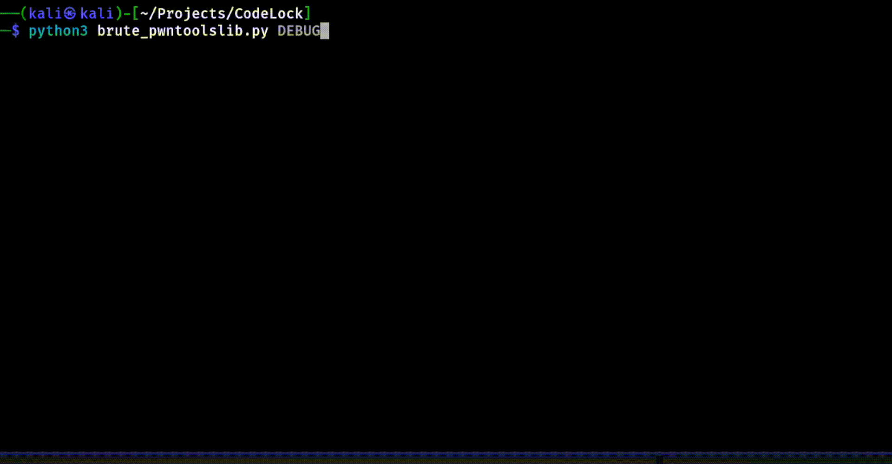
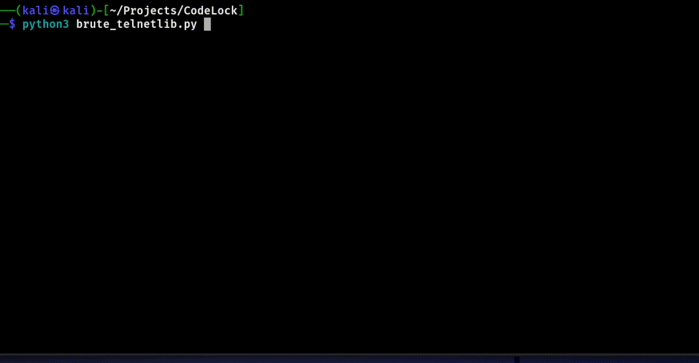
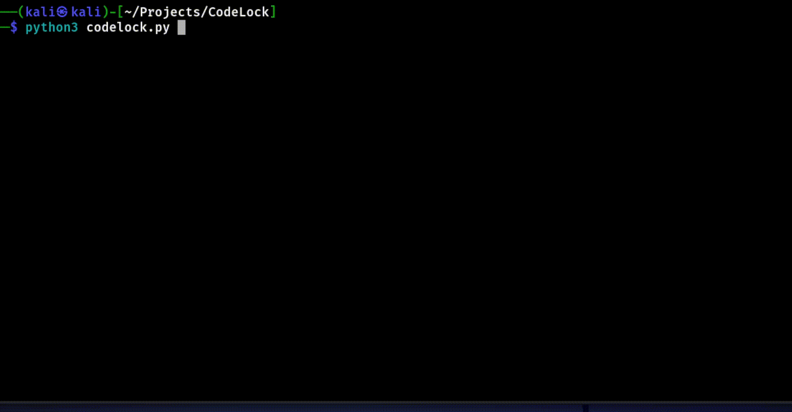

# Description
This is a code simulating the mechanism of a codelock.
The inspiration for this idea was a task from CTF tuctf2023, the task was completely identical (slightly different cosmetically). The mechanics remain the same. The task was this: hack the codelock and get a flag (the password is generated every time the program is started).
The `brute*.py` files are the solution to the task; they are written in different libraries.

# Settings

If you want to try the task yourself, you can run the script using python, if you want to see how the program selects the password, use the following commands:

## Initialization

`sudo ncat -lvp 1234 -k -e "$(which python3) /path/to/script/codelock.py"`

### Brute Forcing

For some reason, the code written using the pwntoolslib library does not work correctly (when changing the r.recivline() parameter, the code ends up in an infinite loop), so the only way to get the flag using this library in my case is to use DEBUG :

`python3 brute_pwntoolslib.py DEBUG`

Code using another library works correctly:

`python3 brute_telnetlib.py`

# Images

## First script

## Second code

## CodeLock game

# DISCLAIMER

I’m NOT a programmer, for me Python is just a tool for accomplishing my tasks.
